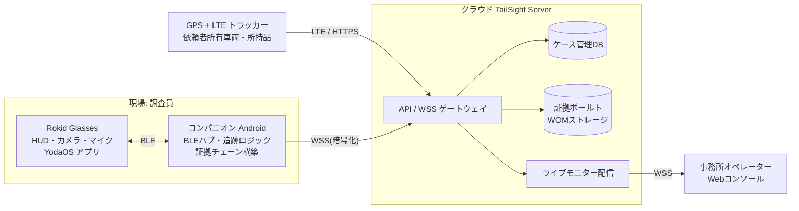
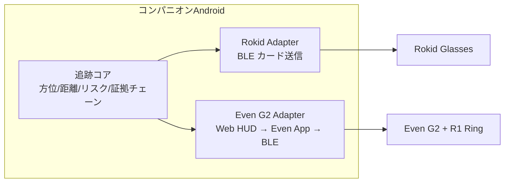

# TailSight TS-G1 システム設計書
## 探偵事務所向け 調査支援スマートグラスシステム（Rokid Glasses ベース）

- 版数: v1.0（2026-09-28）
- 想定読者: 探偵事務所オーナー / システム開発者 / 法務レビュアー
- コンセプト元ネタ: 名探偵コナン「犯人追跡メガネ」（追跡・レンズ内位置表示）を、**実務・法令に適合する形**で業務製品化する

> ⚠️ 本書は技術設計文書であり法的助言ではない。販売前に弁護士による法務レビューを受けること（§15）。

---

## 1. エグゼクティブサマリー

TailSight TS-G1 は、Rokid Glasses（ARディスプレイ+カメラ+マイク内蔵スマートグラス）を調査員が装着し、
**GPSトラッカーの位置をレンズ内HUDに常時表示**、**状況イベントを改竄不能な証拠チェーンとして自動記録**するシステムである。

コナンのメガネの中核機能を次のように「実務版」へ翻訳した:

| コナンの機能 | TS-G1 での実装 | 備考 |
|---|---|---|
| 追跡（半径20km） | GPS+LTEトラッカー（全世界対応）+ 方位・距離HUD | 依頼者所有物・同意取得済みに限定 |
| 左レンズ位置表示 | Rokid waveguide ディスプレイへの矢印・距離・状態カード | 単眼グリーンHUD |
| 盗聴 | **実装しない**（違法リスク大）。調査員当事者の音声メモのみに置換 | §3 参照 |
| 望遠鏡 | グラスカメラのデジタルズーム+HUD表示 | 記録はLED点灯下行う |
| カメラ撮影・伝送 | 1人称撮影→即時ハッシュ化→事務所へライブ共有 | 証拠チェーンに自動登録 |

**「売れるレベル」の定義**: 探偵事務所が買う理由は「尾行の成功率向上」だけでなく、
**「報告書の証拠性が上がる」「法令違反リスクをシステム側で防止できる」「研修コストが下がる」**の3点である。
本設計はこの3点を最優先する。

---

## 2. ターゲットとユースケース

### 2.1 顧客
- 届出済み探偵事務所（探偵業法4条の公安委員会届出事業者）。目標: 尾行・素行調査を月20件以上抱える中堅事務所
- 1事務所 2〜6 名の調査員チーム運用

### 2.2 主要ユースケース
1. **車両尾行**: 依頼者所有車両に取り付けたトラッカーの位置をHUDで追跡。見失い時に最終既知位置（LKP）へ誘導
2. **徒歩尾行サポート**: 対象の停止/移動の変化を自動検知し、HUD通知＋自動記録。距離が開いたら「接触喪失リスク」警告
3. **証拠撮影**: 目撃場面をグラスカメラで撮影。撮影時刻・位置・操作者がハッシュチェーン記録され、報告書にそのまま転記可能
4. **事務所との連携**: 事務所オペレーターがライブモニターで複数調査員の状況を把握し、無線指示を出す（バディシステム）
5. **行方不明者調査**（依頼者家族の同意がある場合）: 所持品に取り付けたタグの位置追跡

---

## 3. コンプライアンスファースト設計（本製品の根幹）

探偵業は合法だが、**使う道具が違法だと事務所ごと摘発される**。Therefore、違法になり得る機能をシステム的に封じ、
その封印自体を販売ポイントとする設計方針を取る。

### 3.1 機能制約マトリクス

| リスク行為 | 法令・裁判例リスク | TS-G1 の設計上の対応 |
|---|---|---|
| 他人の車両へのGPS無断取付 | 器物損壊・住居侵入等を巡る刑事裁判例あり | トラッカー登録時に**依頼者の所有権宣誓＋電子署名**を必須化。未署名トラッカーは位置データを返さない（サーバ側強制） |
| 盗聴（会話の秘密録音） | 電気通信事業法4条、不法行為（民法709条） | 対象者の音声は一切取得しない。調査員の音声メモ（自分の発話）＋**調査員⇔事務所間の同意済み双方向音声リンク**のみ |
| 私空間への侵入撮影 | 住居侵入（刑法130条）・プライバシー侵害 | 撮影は**屋外・公開場所**を前提とした操作フロー。撮影時はカメラLED点灯（ハード仕様）。屋内判定（自宅敷地ジオフェンス）時は撮影UIをロック |
| 無断顔認識・データベース照合 | 要配慮個人情報（個人情報保護法2条）リスク | 顔認識の**無差別収集・DB照合はしない**。依頼者提供の参照写真1枚との**1:1本人確認**のみ（照合結果は証拠チェーンに記録） |
| 調査データの漏洩 | 個人情報保護法、探偵業法12条（秘密保持） | 顧客間テナント分離、静止時に暗号化、調査終了からN日後の自動削除ポリシー |
| 技適未取得機器の使用 | 電波法（技術基準適合証明） | 全構成機器は技適取得品のみ。Rokid Glasses の国内投入形態は販売前に要確認（§15） |
| 依頼目的外利用 | 探偵業法（差別的依頼・犯罪利用の拒否義務） | ケース開始時に依頼目的を構造化入力し、禁止目的ワードでフラグ。記録保存 |

### 3.2 セッション開始ゲート（運用ルールのシステム強制）
調査セッションは次の3ステップを踏まないと起動しない。PoCデモにも同一フローを実装した。

1. **案件登録**: 依頼者ID・探偵業法7条の面接記録への参照・調査目的
2. **トラッカー同意確認**: 対象トラッカーに紐付いた依頼者宣誓書（所有物である旨）の有効確認
3. **調査員割当**: 装着者・事務所オペレーターの割当と記録

### 3.3 記録・保持ポリシー
- 収集データは案件単位で集約。**調査終了＋依頼者報告完了から90日で自動削除**（訴訟見込みがある場合は保全延長フロー）
- 削除は論理削除→物理消去の2段階、削除証明書を案件に添付

---

## 4. システムアーキテクチャ



### 4.1 構成要素の責務

| 要素 | 形態 | 責務 |
|---|---|---|
| グラスアプリ | Rokid Glasses上 (YodaOS/JS) | HUD表示（矢印・距離・状態カード）、音声コマンド入力、撮影指示、音声メモ |
| コンパニオンアプリ | Android スマホ | トラッカー位置取得、方位/距離/リスク計算、グラスへのBLE送信、証拠ハッシュチェーン構築・送信、オフライン継続 |
| サーバ | クラウド (東京リージョン) | ケース・同意・トラッカー管理、証拠保管（追記専用）、ライブモニター、Merkleルートのタイムスタンプ公証 |
| Webコンソール | ブラウザ | 事務所向け: ライブモニター、報告書ドラフト自動生成、証拠チェーン検証UI |

### 4.2 デバイスアダプタ層 — Rokid / Even G2 デュアル対応

TS-G1はグラスを「薄い表示・入力端末」とみなし、機種差を吸収する**アダプタ層**を挟む。
ロジックは共通コンパニオン/サーバに置き、デバイス毎の差分（カメラ有無・音声出力・HUD仕様）は能力フラグで自動分岐する。
PoCでは `poc/device-adapters.js` として実装済み（UIでデバイス切替可）。

| 項目 | Rokid Glasses | Even Realities G2 |
|---|---|---|
| ディスプレイ | waveguide 480×398/眼（緑単色） | 両眼 640×350（緑単色） |
| カメラ | 12MP 内蔵 → **証拠撮影はグラス単体** | なし → **スマホカメラで代用** (actor=phone) |
| マイク | 4基（音声コマンド） | 4基（音声コマンド） |
| スピーカー | 内蔵（音声応答可） | なし → イヤホンで応答 |
| 操作入力 | テンプル操作＋音声 | R1リング＋音声 |
| アプリ形態 | YodaOSグラスアプリ＋電話SDK（x-docs.rokid.com / AIUIカード） | WebアプリをEven App(WebView)が読み込みBLE中継（awesome-even-realities-g2 / even-g2-notes / everything-evenhub） |
| HUD送信 | guidanceカード（構造化） | HUD行データ（短文4行程度） |



共通I/F: `caps{camera, speaker, mic, ring}` / `photoActor` / `packet(state) → デバイス向け描画データ`。
採用判断: 尾行で撮影まで完結させたい現場は Rokid、表示・音声コマンド中心で電池を持たせたい現場・開発の容易さは Even G2。両対応により供給リスク（在庫・技適・SDK変更）を分散する。

### 4.3 Rokid開発基盤の利用方法
Rokid公開ドキュメント（x-docs.rokid.com / open.rokid.com）に基づく:

- **電話側SDK + グラス側SDK の2段構成**。グラス↔スマホ間はBluetooth で接続・メッセージ交換
- グラス側: カードUI（AIUI エージェント / JS カード）でHUD相当の表示、音声AI（wake word→インテント）
- メディアAPI: 写真・録画・マイク、視覚認識サンプルあり
- 補足: コミュニティによる BLE プロトコル資料・スターターキット（glasskit 等）も活用可能

TS-G1 ではグラス側を「薄い表示・入力端末」とし、**ロジックは全てコンパニオン/サーバに置く**。
理由: グラスの電池温存、機種変更耐性、審査・改修の迅速化。

---

## 5. ハードウェア構成（BOM）

| # | 機材 | 数/セット | 想定単価 | 備考 |
|---|---|---|---|---|
| 1 | Rokid Glasses（カメラ+ディスプレイ+マイク+スピーカー、約49g） | 1 | ¥95,000前後 | 技適・国内保修形態は要確認 |
| 2 | GPS+LTEトラッカー（磁着/携帯型、技適取得品） | 2 | ¥12,000 | 車両用+予備。充電器付 |
| 3 | Androidスマホ（調査員支給、既存流用可） | 1 | ¥40,000 | コンパニオン専用にすると安価 |
| 4 | モバイルバッテリー＆グラス充電ケース | 1 | ¥8,000 | 長時間尾行対応 |
| 5 | 骨伝導/イヤホン（指示受信用） | 1 | ¥10,000 | グラス音声は非公開音声出力 |
| 6 | ケース・備品一式 | 1 | ¥15,000 | |

セット原価 約 ¥19万円。販売価格は §14 参照。

**Even G2 セット（代替構成）**: グラスを Even Realities G2 に替えても価格はほぼ同等（~¥95,000）。
カメラがない分、証拠撮影は調査員スマホカメラで行い（チェーンの actor=phone 記録）、
グラスは追跡HUD・音声コマンド・R1リング操作に特化。長時間HUD表示での電池持続で有利（§4.2）。

**追跡タグに関する技術選定メモ（AirTag不採用の理由）**:
- リアルタイム性なし: AirTagはGPS非搭載で、周囲の第三者のiPhoneが近くにないと位置が更新されない（繁華街でも数分遅れ、郊外では時間単位）
- 公式APIなし: Find Myネットワークの位置取得APIは存在せず、TailSightのようなシステムに統合できない（手動でアプリを開くしかない）
- アンチストーキング設計: 所有者と離れたAirTagが対象者と同行すると、**対象者のiPhoneに警告通知が出る**（8〜24時間で音も鳴る、AndroidのTracker Detectでも検知）。調査用途では対象に気づかれる＝調査失敗
- 無断取付はストーカー規制法・不法行為リスク（GPSと同じ）
- 結論: 粗位置は LTE+GPSトラッカー（API付き）、**最終接近(10-30m)のみUWB（AirTagの精密探索）を"依頼者所有物"に限定併用**、という二段構えは検討価値あり（Phase 2）

**Even G2 実機シミュレータ（開発環境）**:
公式シミュレータ `@evenrealities/evenhub-simulator` がnpmで配布されている（ネイティブアプリ、`--automation-port` によるHTTP自動化付き）。ローカル検証手順:
```bash
git clone https://github.com/BxNxM/even-dev && cd even-dev && npm install
./start-even.sh clock            # サンプルアプリをシミュレータで表示
# 手動インストールの場合: npm i @evenrealities/evenhub-simulator @evenrealities/sim-darwin-arm64
```
TailSightの `packet()` 出力をEven Hub SDKのHUD APIに流し込むアダプタを書けば、実機とほぼ同一の見え方で開発できる。

---

## 6. ソフトウェア設計

### 6.1 グラスアプリ（HUD仕様）

グリーン単色ディスプレイを想定したカード構成:

```
┌──────────────────────┐
│ CASE-2026-0007  REC ●│   ← 案件ID・録画/セッション表示
│                      │
│        ▲             │   ← 対象への相対方位矢印（頭の向き基準）
│   距離 142m  徒歩1:50 │   ← 距離・徒歩ETA
│   対象: 移動中 4km/h  │   ← 停止検知/移動/速度
│   位置情報 3秒前       │   ← トラッカー受信遅延
│──────────────────────│
│ ⚠ 距離拡大 250m超     │   ← リスクバナー（正常時は非表示）
│ 🎙 「状況」→ 表示中    │   ← 直近音声コマンド応答
└──────────────────────┘
```

カード種別: `guidance`（通常追跡）/ `alert`（停止検知・リスク）/ `lkp_guide`（見失い→最終既知位置誘導）/ `confirm`（撮影・メモ確認）
音声コマンドは wake word「テイルサイト」+ インテント名で処理（§11）。

### 6.2 コンパニオンアプリ（中核ロジック）

```
tick(毎秒):
  pos_t = トラッカー最新位置(サーバ or SMSフォールバック)
  pos_i = 調査員GPS + 歩行推定(PDR)
  d     = haversine(pos_i, pos_t)
  brg   = 初期方位角(pos_i → pos_t)
  state = 停止検知(移動速度<0.3m/s が15秒以上) / 移動中
  risk  = d>400m:CRITICAL, d>250m:WARN, else OK
  → グラスへBLE送信(guidanceカード)
  → イベント検知で証拠チェーンにappend
```

- **オフライン耐性**: サーバ不通時はローカルでチェーン構築を継続し、復帰時に一括送信（順序はデバイス時計＋シーケンスで整列）
- **見失い対応**: 調査員の「見失い」申告でモード切替。LKP（Last Known Position）への誘導矢印に変わる。再接近で自動的に「再捕捉」イベント

### 6.3 サーバ
- 言語/基盤: Go or Node.js + PostgreSQL + S3互換オブジェクトストレージ（オブジェクトロック=WORM有効）
- 証拠ボールト: 追記のみ許可。毎日24:00 JST に Merkle ルートを計算し、信頼できるタイムスタンプ局（TSA）で公証
- ライブモニター: WSS で調査員↔事務所双方向。位置ストリームは5秒粒度、証拠イベントは即時

---

## 7. データモデルとAPI

### 7.1 データモデル（主要エンティティ）

| エンティティ | 主な字段 | 概要 |
|---|---|---|
| Case | id, 事務所id, 依頼者id, 目的, 面接記録ref, 期間 | 案件 |
| ConsentRecord | id, case_id, トラッカーid, 宣誓書ハッシュ, 署名, 有効期限 | 所有物宣誓（§3） |
| Tracker | id, imei, 種別, 台帳, 电池/通信状態 | 端末 |
| Session | id, case_id, 調査員id, 開始/終了時刻, デバイス構成 | 装着セッション |
| Event | seq, session_id, ts, type, payload, actor, prev_hash, hash | ハッシュチェーン（§8） |
| EvidenceItem | id, event_seq, 種別(photo/memo), ファイルSHA-256, EXIF, 保存先 | 実体ファイル参照 |

Event.type 一覧: `session.start` / `session.end` / `target.stop_detected` / `target.resume` / `risk.warn` / `risk.critical` / `lost.declared` / `target.reacquired` / `evidence.photo` / `evidence.memo` / `voice.command` / `subject.verify` / `audio.link` / `deduce.prediction` / `office.push` / `compliance.gate`

### 7.2 API（抜粋）

| メソッド/パス | 用途 |
|---|---|
| POST /v1/cases | 案件登録（目的チェック込み） |
| POST /v1/consents | 宣誓書登録（トラッカー有効化） |
| POST /v1/sessions | セッション開始（ゲート通過確認） |
| POST /v1/sessions/:id/events | イベント追加（チェーン検証してから保存） |
| GET /v1/sessions/:id/timeline | タイムライン取得（報告書用） |
| GET /v1/trackers/:id/position | トラッカー最新位置 |
| WSS /v1/live/:case_id | ライブモニター |
| POST /v1/evidence/:id/anchor | 証拠のMerkle公証状態照会 |

---

## 8. 証拠チェーン（Chain of Custody）設計

「写真1枚の証拠能力」を「システム全体の記録」で裏付けるのが本製品の差別化である。

```
entry = {
  seq, session_id, ts(ISO8601), type, actor(調査員/端末/サーバ),
  payload,
  prev_hash,
  hash = SHA-256( prev_hash | canonical_json(seq,session_id,ts,type,actor,payload) )
}
```

- **正準化JSON**（キー辞書順）でハッシュ → 環境差異耐性
- 写真・音声メモは本体のSHA-256を payload に含め、実体はWOMストレージへ
- 改竄検証: `verify(chain)` が1エントリでも不一致なら即 FAIL（PoC同梱・実装済み）
- 日常運用: 事務所コンソールに「検証」ボタン。報告書添付時は検証結果を同梱
- 高度な防御（Phase 2）: 1日毎のMerkleルートをTSA公証 + 月次で公証ルートを印刷保存

---

## 9. セキュリティ設計

| 項目 | 方針 |
|---|---|
| 通信 | 全経路TLS/WSS。BLE区間はアプリ層で暗号化（事前ペアリング鍵） |
| 保存 | 証拠ボールトはオブジェクトロック（WORM）。DBは暗号化 |
| 認証 | 調査員: デバイス証明書+PIN。事務所: SSO+役割（管理者/オペレーター/調査員） |
| テナント分離 | 事務所単位の完全論理分離（DBスキーマ分離） |
| 監査 | 全管理操作を別系統の監査ログに記録 |
| 紛失対策 | スマホ/グラス紛失時のリモート無効化、グラス側に案件データを保持しない |

---

## 10. 信頼性・運用設計

- **バッテリ**: グラス連続表示は数時間レベル → 表示は必要時のみ（変化時点灯）、常時は最小カード。充電ケース運用
- **通信途絶**: トラッカーはLTE圏外時に位置を自身に蓄積→復帰時一括送信（端末選定条件）。調査員側はオフライン継続（§6.2）
- **安全装置（ヒューマンファクタ）**:
  - 距離600m超で5分継続 → 事務所へ自動エスカレーション
  - 調査員の心拍/静止検知（Phase 2）→ 緊急通報
- **教育**: セッション開始ゲートが教育そのものになる設計（毎回同意フローを通る）

---

## 11. 音声コマンド仕様（グラス）

| 発話 | インテント | 動作 |
|---|---|---|
| 「テイルサイト 追跡開始」 | session.start | セッション開始（ゲート済みであること） |
| 「状況」 | status.read | 距離・状態をカード再表示＋音声読み上げ |
| 「メモ …」 | evidence.memo | 音声メモを文字化しチェーン記録（調査員自身の発話のみ） |
| 「証拠保存」 | evidence.photo | グラスカメラ撮影→即時ハッシュ→チェーン記録 |
| 「見失った」 | lost.declared | LKP誘導モードへ切替 |
| 「再捕捉」 | target.reacquired | 通常追跡へ復帰 |
| 「本人確認」 | subject.verify | 依頼者提供の参照写真1枚と1:1照合し結果を記録（DB照合なし） |
| 「事務所呼出」 | audio.link | 同意済み双方向音声リンクを開閉（対象者の音声は取得しない） |

「盗聴して」「録音して」等はインテント自体が存在しない（§3）。

---

## 12. 同梱 PoC デモ（`poc/`）

ブラウザ単体で動く中核ループのデモ。実装済み:

1. **同意ゲート**: セッション開始前に3項目の確認を強制（§3.2 の縮小版）
2. **戦術マップ**: 調査員/対象（トラッカー）/LKP表示、軌跡記録（新宿・歌舞伎町周回コースを模擬）
3. **HUD（Rokid相当の緑単色）**: 相対方位矢印・距離・徒歩ETA・対象状態・位置情報遅延・リスクバナー
4. **イベント自動検知**: 停止検知(15秒閾値)・再開・距離リスク・見失い申告→LKP誘導→再捕捉
5. **証拠ハッシュチェーン**: 全イベントをSHA-256チェーンで記録。改竄検証・JSON書き出し（実装は `evidence-chain.js`、試験 `test/chain.test.js`）
6. **音声コマンド模擬**: プルダウンでインテント発行（実機ではRokid音声AI / Even G2は音声コマンドAPI）
7. **デバイスアダプタ**: `device-adapters.js` で Rokid / Even G2 を切替。カメラ有無で証拠撮影経路（グラス↔スマホ）が自動分岐し、送信パケット形式（カード型↔短文HUD行）も切替（試験 `test/device.test.js`）
8. **合法代替機能の実演**: ①本人確認＝依頼者提供写真との1:1照合のみ（DB照合なし） ②事務所との同意済み双方向通話 — いずれもチェーン記録される
9. **推理エンジン DEDUCE**: 進行方向・距離・滞在頻度から次の目的地を確率予測（softmax）しHUD/パケットに表示。自然文サマリー自動生成
10. **タイムリプレイ**: 全セッションを1秒粒度で記録し、シークバーで再生（報告書用デモ・事実確認用）
11. **滞在ヒートマップ**: POI別滞在時間を地図上に可視化（素行調査の「良く行く場所」報告要素）
12. **音声読み上げ**: Web Speech API(ja-JP)で停止検知・リスク・指示を音声告知（Rokid内蔵スピーカー/Even G2はイヤホン）
13. **事務所→調査員プッシュ**: オペレーターが「接近注意/迂回指示/調査中断」をワンクリックで調査員HUDへ割込み表示＋音声告知
14. **報告書自動生成**: 証拠チェーンから調査報告書ドラフト（統計・サマリー・タイムライン・根本ハッシュ）を生成、印刷/HTML保存
15. **起動演出**: 追跡モード起動シーケンス（生体認証→接続→チェーン初期化）、追跡中は📡アンテナが点滅
16. **装着視界シミュレータ**: 実機なしでグラス越しの一人称視界を再現。夜の街並みパノラマ+世界固定ARピン（対象方向に固定、ドラッグで首振り）+デバイス別HUD配置（Even G2=上部中央の短文HUD／Rokid=中央下のカード）。実機シミュレータとしては Even G2 に even-dev（Even Hub simulator）が存在し、実運用ではポーズ(`packet()`)をそのまま流用可能

実行方法: `poc/index.html` を開く（地図タイルはCDN。オフライン時はレーダー fallback）。

---

## 13. 開発ロードマップ

| フェーズ | 期間 | 内容 | 出荷物 |
|---|---|---|---|
| Phase 0 | 完了 | 設計書+ブラウザPoC（本書） | 本リポジトリ |
| Phase 1: MVP | 6〜8週間 | コンパニオンAndroid（追跡ロジック・チェーン）、RokidグラスHUDカード、シングルテナントサーバ | 1事務所での社内試験 |
| Phase 2: Pilot | 8週間 | ライブモニター、報告書ドラフト、WOM・Merkle公証、実地フィードバック反映 | 2〜3事務所での商用トライアル |
| Phase 3: 販売 | 継続 | 法務レビュー完結、技適・保修体制、研修カリキュラム、保守SLA | 正式販売 |

技術リスクと対応: Rokid SDK の詳細仕様変化 → 抽象レイヤを挟む。グラス在庫/国内流通 → XREAL等の代替表示デバイス対応を抽象化で担保。

---

## 14. 販売パッケージ・価格（案）

| 項目 | 価格案 | 内容 |
|---|---|---|
| TS-G1 スターターセット | ¥480,000（セット原価〜2.4倍） | グラス1・トラッカー2・コンパニオン・導入研修1日 |
| SaaS 利用料 | ¥39,800/月/事務所（〜5席） | サーバ・証拠ボールト・ライブモニター・サポート |
| 追加調査員キット | ¥180,000 | グラス+バッテリ+ライセンス |
| 報告書サポート（オプ） | ¥9,800/月 | 報告書ドラフト自動生成 |

販売トークの軸: 「尾行成功率アップ」×「報告書の証拠性」×「違法利用の構造的防止（=事務所防衛）」

---

## 15. リスクと法規制チェックリスト（販売前必須）

- [ ] 弁護士による法務レビュー（探偵業法・個情法・電気通信事業法・刑法・ストーカー規制法）
- [ ] Rokid Glasses の技適（電波法）・国内正規流通・保修の確認。不可なら代替機種選定
- [ ] GPSトラッカーの技適・契約回線（IoT SIM）の正当利用
- [ ] 依頼者宣誓書テンプレートの法律的検証
- [ ] 顔・ナンバー等の認識機能を入れない方針の明文化（カタログ・マニュアル）
- [ ] データ保持・削除ポリシーの最終化と、削除証明書フォーマット
- [ ] 調査員向け安全教育資料（道路・車両運用）
- [ ] 事故時の免責・SLA 規程

---

## 参考リンク（調査日: 2026-09-28）

- Rokid 開発者ドキュメント: https://x-docs.rokid.com / https://open.rokid.com
- Rokid Glasses 公式: https://global.rokid.com
- コナンのメガネ公式設定: https://www.ytv.co.jp/conan/item/glasses
- スマートグラスでの実現可能性検討記事: https://realsound.jp/book/2021/09/post-851088_2.html
